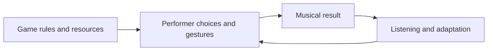

# MOO.F.O.

**A gamified audiovisual system for an interactive electronic improvisation ensemble.**

MOO.F.O. brings the competitive dynamics of video games into collective music-making. Performers control a cow, a UFO, and an alien, pursuing victory while improvising together. Each character has a different attack mechanism and resource cycle, creating distinct patterns of action, restraint, and recovery.

The game functions as a dynamic score. Its rules, visual feedback, and unpredictable encounters shape the performers' attention, gestures, and musical decisions. Competition gives each performer an individual objective, while their actions contribute to a shared sonic environment. The work explores the tension between individual ambition and collective creation, allowing musical form to emerge through strategy, conflict, and chance.

Created by **Lingyuan Yang**, 2026.

[Project website](https://www.lingyuanyang.com/works/moofo) · [Performance video](https://www.youtube.com/watch?v=Kxwvca3FFfk) · [Technical documentation](docs/TECHNICAL.md)

The work was presented at [The Performer-Composer in the 21st Century symposium](https://performercomposersymposium.wordpress.com/).

## How the game shapes the performance

The objective is to defeat opponents and earn points. The highest score at the end of a timed match wins; the current implementation also supports a draw. Defeated characters respawn, allowing the competitive exchange to continue throughout the match.

| Role | Game mechanics | Implications for improvisation |
| --- | --- | --- |
| **Cow** | Eat grass to replenish milk; spend milk to fire projectiles. | Alternating between replenishment and attack encourages rhythmic pacing and resource management. |
| **UFO** | Fire a pressure-controlled laser; sustained firing builds heat and can cause overheating. Starting a firing sequence may also drop a bomb. | Sustained gestures are balanced against cooling periods, encouraging decisions about continuity, intensity, and risk. |
| **Alien** | Strike with the hands, feet, or head; attacks consume stamina, which recovers when attacks stop. | Short bursts and recovery intervals encourage explosive gestures and changes in event density. |

These mechanics influence how performers act, rather than prescribing a fixed sequence of notes. Timing, repetition, gesture density, sustain, and risk-taking become compositional variables. Through the performance's sound mappings, they can shape timbre, energy, texture, dynamics, and the density of interaction.

## Controllers and performance gestures

Each role uses a different physical interface, giving the performers distinct ways to move, attack, and shape their improvisation.

| Role | Controller | Performance controls |
| --- | --- | --- |
| **Cow** | **PS5 DualSense controller** | Move with the **left analog stick**. Hold the **cross (× / X)** button to eat grass; press the **triangle (△)** button to fire milk projectiles. |
| **Alien** | **ElastremeSense Manu-5D e-skin data glove kit** and **keyboard** | Move with **W/S/A/D**. The glove's five **movement detectors** trigger attacks. |
| **UFO** | **Drawing tablet interface using iDraw-OSC** | Drawing **X/Y position** controls movement; **stylus pressure** controls the laser. |

The cow combines joystick movement with discrete button actions. The alien combines keyboard navigation with movement-triggered glove gestures. The UFO uses a continuous drawing gesture whose pressure changes laser strength and heat accumulation. These interfaces give each role a different relationship between physical action, game strategy, and musical phrasing.

The glove hardware and processing are documented in [glove-system](https://github.com/lingyuanyangg/glove-system). The drawing interface is provided by [iDraw-OSC, by Gwangyu Lee](https://github.com/gwangyu-lee/iDraw-OSC). See the [controller integration details](docs/TECHNICAL.md#physical-controllers-and-routing) for OSC routing and setup.

## Chance and changing conditions

The performance rule map includes entering an underwater world and applying a global filter. Such events change the perceptual environment and invite performers to reconsider their strategies.

The current Unity scene also includes a randomized traffic-light system: yellow warns of an approaching stop, and red suspends actions and penalizes attempted movement or attacks. This introduces a shared interruption into the competition. The technical documentation distinguishes these implemented mechanics from the broader performance rules.

## Technology

The repository contains the Unity game and visual system:

- **Unity 6000.4.9f1** and **C#** for character control, physics, combat, scoring, and match management.
- **Open Sound Control (OSC)** through the bundled **extOSC** library for incoming control data.
- **Universal Render Pipeline (URP)** and custom shaders for the fluorescent arena, outlines, spectral effects, and visual distortion.
- A HUD displaying health, character resources, scores, the timer, and the match result.

The main game scene is [HandLowPoly.unity](Assets/Scenes/HandLowPoly.unity). Core gameplay scripts are in [OSCMeadowGame](Assets/My%20Assets/Script/OSCMeadowGame).

The musical relationships described above express the performance design. This repository does not include the external sound patches or a complete controller-to-sound mapping, and the custom gameplay scripts do not implement outgoing OSC game-state messages. See [the technical documentation](docs/TECHNICAL.md) for the available interfaces and setup.

## Opening the project

1. Clone or download this repository.
2. Open its root folder in Unity Hub with **Unity 6000.4.9f1**, and allow the package dependencies to resolve.
3. Open `Assets/Scenes/HandLowPoly.unity`.
4. On the `OSCcontrol` object, configure the OSC receiver's local host for your machine and use UDP port **7001**, or update both sender and receiver to a matching port.
5. Connect the DualSense, Manu-5D glove and keyboard, and iDraw-OSC drawing interface using the [controller routing](docs/TECHNICAL.md#physical-controllers-and-routing) and [documented addresses and value ranges](docs/TECHNICAL.md#osc-control-interface).
6. Enter Play mode, choose a match duration, and press **START GAME**.

A full performance additionally requires the performers' controllers, sound instruments or patches, and audio routing to be configured for the intended setup.
