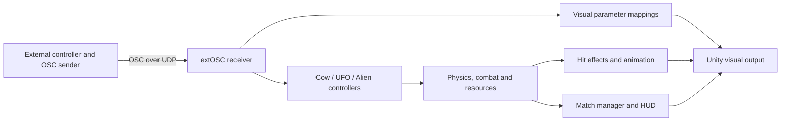

# Technical Documentation

This document describes the Unity implementation of MOO.F.O. and its incoming OSC interface. It is based on the source code and the serialized `HandLowPoly` scene. Musical implications are informed by the performance rule map; they are not a specification of an included synthesis engine.

[Return to the project introduction](../README.md)

## Project configuration

| Component | Recorded version or location |
| --- | --- |
| Unity Editor | **6000.4.9f1**, recorded in `ProjectSettings/ProjectVersion.txt` |
| Universal Render Pipeline | **17.4.0** |
| Input System | **1.19.0** |
| Cinemachine | **3.1.7** |
| OSC implementation | Bundled **extOSC** source in `Assets/My Assets/extOSC` |
| Main game scene | `Assets/Scenes/HandLowPoly.unity` |
| Core gameplay scripts | `Assets/My Assets/Script/OSCMeadowGame` |

Package versions are recorded in [manifest.json](../Packages/manifest.json). The main game scene is enabled in [EditorBuildSettings.asset](../ProjectSettings/EditorBuildSettings.asset).

## System architecture

Incoming OSC data is received by an extOSC `OSCReceiver` on the `OSCcontrol` scene object. Character controllers bind to named addresses and convert the incoming values into movement, attack requests, or sustained control states. Rigidbody physics handles movement; character-specific logic manages resources, damage, and respawning.

The implemented OSC path is **incoming control data → Unity gameplay and visuals**. A complete performance must also establish its sound instruments and mappings. The custom gameplay scripts expose properties such as health, milk, heat, stamina, and attack state within Unity, but do not transmit them to an external audio system. Any integration that needs those states must add its own output layer.

## OSC control interface

The main scene stores receiver port **7001** and a machine-specific local host. Configure the receiver's local host for the machine running Unity; the sender's destination must match its reachable address and port.

The following addresses are the defaults used by the character controllers and are also serialized in the main scene. Character inputs accept a numeric float or integer and clamp it to **0–1**. Use floats for continuous control; **0.5** is the neutral position for the cow and UFO movement axes. Values above **0.5** activate button-like inputs.

| Role | OSC address | Interpretation |
| --- | --- | --- |
| Cow | `/GameControlLX` | Horizontal movement, 0–1; center at 0.5. |
| Cow | `/GameControlLY` | Movement on the arena's other horizontal axis, 0–1; center at 0.5. |
| Cow | `/Jump` | A value above 0.5 requests a jump; grounded and resource-state checks still apply. |
| Cow | `/Eat` | Hold above 0.5 to eat when grounded; send 0 to release. |
| Cow | `/Shoot` | A value above 0.5 requests a shot, subject to milk and cooldown checks. |
| UFO | `/tabletX` | Horizontal movement, 0–1; center at 0.5. |
| UFO | `/tabletY` | Movement on the arena's other horizontal axis, 0–1; center at 0.5. |
| UFO | `/tablePressure` | Sustained beam control; above 0.5 enables firing when a valid target is available. |
| UFO | `/tabletPressure` | Alternate address for the same pressure control. |
| Alien | `/R1` | Left-hand attack. |
| Alien | `/R2` | Right-hand attack. |
| Alien | `/R3` | Left-foot attack. |
| Alien | `/R4` | Right-foot attack. |
| Alien | `/R5` | Head attack. |

Alien attacks trigger on a transition from low to high. Send a low value between attacks to re-arm the input. Alien walking currently uses **W/A/S/D** through Unity's Input System and moves relative to the camera.

Cow jump and shoot inputs use short time-based debounce checks, followed by their gameplay checks. They are not implemented with the alien's low-to-high edge detection. For discrete button presses, send a high value followed by a low value.

UFO beam strength is calculated from pressure above its threshold. Increasing pressure increases both damage and heat accumulation. Release pressure to cool down; overheating blocks firing until heat falls to the restart threshold.

Additional scene inputs are `/o1`, `/o2`, and `/o3`. These trigger three configured camera-launched hazard prefabs on low-to-high transitions.

## Gameplay and match logic

[OSCCowController.cs](../Assets/My%20Assets/Script/OSCMeadowGame/OSCCowController.cs) manages movement, jumping, eating, and milk projectiles. Eating stops horizontal movement and replenishes milk. A successful shot consumes milk and launches a homing projectile at a randomly selected eligible opponent.

[OSCUFOController.cs](../Assets/My%20Assets/Script/OSCMeadowGame/OSCUFOController.cs) manages hovering, pressure-controlled firing, cooling, and overheating. A beam selects an eligible opponent within range. Bomb probability is evaluated when a firing sequence begins, rather than continuously on every frame; spawning also requires the configured bomb prefab.

[OSCAlienController.cs](../Assets/My%20Assets/Script/OSCMeadowGame/OSCAlienController.cs) manages five attack channels. A successful attack spends stamina and animates an extending and retracting strike. Stamina recovers while no attack is active.

The controllers share the `IOSCCombatant` interface. Damage reduces health; a defeat awards a point to a recognized attacking character and starts the victim's respawn sequence. The match manager tracks the three scores, remaining time, and winner. The scene's configured match duration is **90 seconds**, adjustable from the start screen. Tied highest scores produce a draw.

### Scene parameters

These values come from the serialized main scene and may differ from the initial values declared in C#.

| Parameter | Main scene value |
| --- | --- |
| Character maximum health | 100 for each role |
| Cow maximum milk / milk per shot | 100 / 10 |
| Cow milk recovery / shot cooldown | 19 units per second / 0.48 seconds |
| UFO heat gain / cooling | 38 × beam strength units per second / 23 units per second |
| UFO overheat / restart threshold | 100 / 28 |
| UFO bomb probability at firing onset | 0.2 |
| Alien maximum stamina / cost per attack | 100 / 22 |
| Alien stamina recovery | 18 units per second while not attacking |

A new match resets the cow's milk to its maximum; the scene's serialized initial milk value is 62.

## Visual system and environmental events

The visual system combines custom toon outlines, spectral energy lines, hit flashes, death trails, and camera-plane spectral overlays. `ExperimentalSpectralDirector` animates spectral lighting and overlays and configures exposure and bloom. These effects make actions, impacts, and changing intensity visible to performers and the audience.

The scene's `GlitchManager` maps incoming float values to material parameters. Send values in **0–1**; unlike the character-input helpers, this component reads the first value directly as a float.

| OSC address | Mapped visual control |
| --- | --- |
| `/Glitch/Intensity` | Glitch intensity, 0–1. |
| `/Duotone/Intensity` | Duotone intensity, 0–1. |
| `/JPEG/Intensity` | JPEG-style corruption intensity, 0–1. |
| `/RGB/_ROffset`, `/RGB/_GOffset`, `/RGB/_BOffset` | Channel offsets mapped from 0–1 to −0.05–0.05. |
| `/RGB/_RVertical`, `/RGB/_GVertical` | Vertical channel offsets mapped from 0–1 to −0.05–0.05. |

`MeadowTrafficLight` introduces randomized stop periods during active matches. Its script checks a configurable probability at intervals, displays yellow before red, and returns to green after a sampled duration. During red, controller actions are blocked, and attempted actions can receive damage penalties. Neutral OSC packets do not count as violations.

The supplied performance rule map also describes an underwater world and a global filter. The inspected gameplay scripts do not establish an automatic underwater-event system or a global audio filter. Those descriptions belong to the broader performance design; their triggering and sound processing must be documented with the external performance setup.

## Setup and verification

1. Open the project in the recorded Unity version and load `HandLowPoly.unity`.
2. Configure `OSCcontrol` for the local machine and the sender's destination.
3. Send 0.5 to the four cow/UFO movement axes and 0 to action and pressure inputs to establish neutral controls.
4. Enter Play mode and start a match from the HUD.
5. Verify movement, discrete attacks, sustained pressure, resource depletion and recovery, defeats, respawns, scores, and the result screen.
6. Verify the OSC visual controls and the traffic-light interruption with the intended controller setup.
7. Configure and rehearse the sound mappings and audio routing required for the full ensemble performance.

This documentation was checked against repository source and scene configuration. It does not represent a completed runtime or hardware test.
